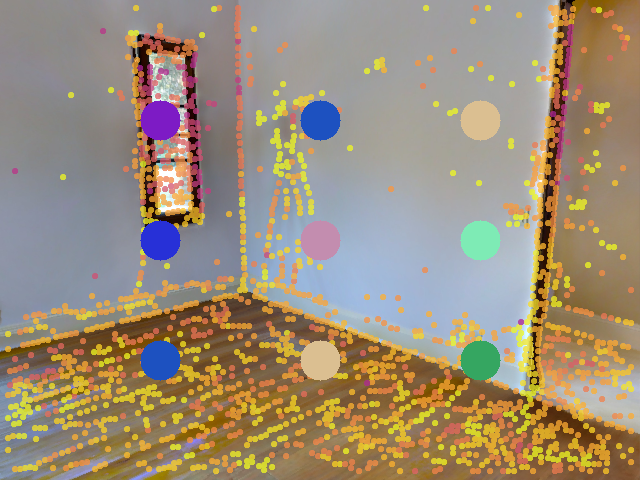
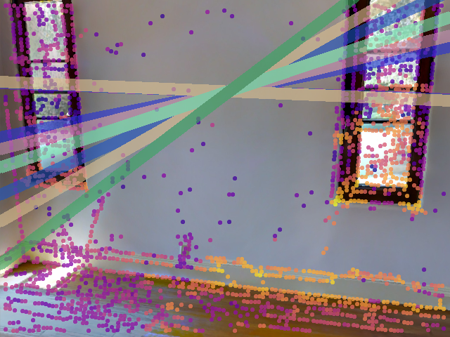
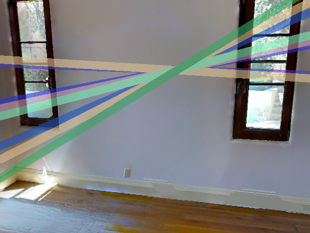
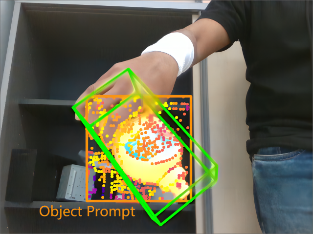
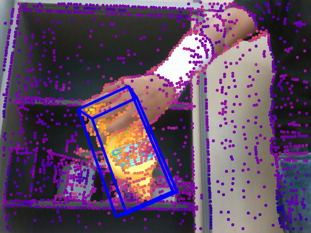
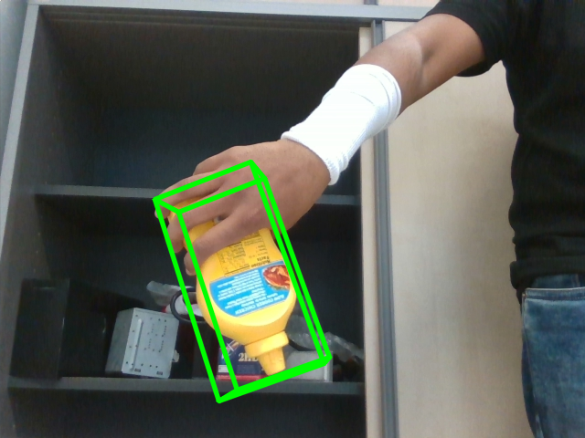

# SRPose: Two-view Relative Pose Estimation with Sparse Keypoints
**SRPose**: A **S**parse keypoint-based framework for **R**elative **Pose** estimation between two views in both camera-to-world and object-to-camera scenarios.

| Reference | Query  |	Ground Truth |
|:--------:| :---------:|:--------:|
|  |  |  |
|  |  ||

## Setup
Please first intall PyTorch according to [here](https://pytorch.org/get-started/locally/), then install other dependencies using pip:
```
cd SRPose
pip install -r requirements.txt 
```

## Evaluation
1. Download pretrained models [here](https://drive.google.com/drive/folders/1bBlds3UX7-XDCevbIl4bnnywvWzzP5nN) for evaluation.
2. Create new folders:
```
mkdir checkpoints & mkdir data
```
3. Organize the downloaded checkpoints like this:
```
SRPose
|-- checkpoints
    |-- ho3d.ckpt
    |-- linemod.ckpt
    |-- mapfree.ckpt
    |-- matterport.ckpt
    |-- megadepth.ckpt
    `-- scannet.ckpt
    ...
```

### Matterport
1. Download Matterport dataset [here](https://github.com/jinlinyi/SparsePlanes/blob/main/docs/data.md), only `mp3d_planercnn_json.zip` and `rgb.zip` are required.
2. Unzip and organize the downloaded files:
```
mkdir data/mp3d
mkdir data/mp3d/mp3d_planercnn_json & mkdir data/mp3d/rgb
unzip <pathto>/mp3d_planercnn_json.zip -d data/mp3d/mp3d_planercnn_json
unzip <pathto>/rgb.zip -d data/mp3d/rgb
```
3. The resulted directory tree should be like this:
```
SRPose
|-- data
    |-- mp3d
        |-- mp3d_planercnn_json
        |   |-- cached_set_test.json
        |   |-- cached_set_train.json
        |   `-- cached_set_val.json
        `-- rgb
            |-- 17DRP5sb8fy
                ...
        ...
    ...
```
4. Evaluate with the following command:
```
python eval.py configs/matterport.yaml checkpoints/matterport.ckpt
```

### ScanNet & MegaDepth
1. Download and organize the ScanNet-1500 and MegaDepth-1500 test sets according to the [LoFTR Training Script](https://github.com/zju3dv/LoFTR/blob/master/docs/TRAINING.md). Note that only the test sets and the dataset indices are required.
2. The resulted directory tree should be:
```
SRPose
|-- data
    |-- scannet
    |   |-- index
    |   |-- test
    |   `-- train (optional)
    |-- megadepth
        |-- index
        |-- test
        `-- train (optional)
        ...
    ...
```
3. Evaluate with the following commands:
```
python eval.py configs/scannet.yaml checkpoints/scannet.ckpt
python eval.py configs/megadepth.yaml checkpoints/megedepth.ckpt
```

### HO3D
1. Download HO3D (version 3) dataset [here](https://www.tugraz.at/institute/icg/research/team-lepetit/research-projects/hand-object-3d-pose-annotation/), `HO3D_v3.zip` and `HO3D_v3_segmentations_rendered.zip` are required.
2. Unzip and organize the downloaded files:
```
mkdir data/ho3d
unzip <pathto>/HO3D_v3.zip -d data/ho3d
unzip <pathto>/HO3D_v3_segmentations_rendered.zip -d data/ho3d
```
3. Evaluate with the following commands:
```
python eval.py configs/ho3d.yaml checkpoints/ho3d.ckpt
python eval_add_reproj.py configs/ho3d.yaml checkpoints/ho3d.ckpt
```

### Linemod
1. Download Linemod dataset [here](https://bop.felk.cvut.cz/datasets/) or run the following commands:
```
cd data

export SRC=https://bop.felk.cvut.cz/media/data/bop_datasets
wget $SRC/lm_base.zip         # Base archive with dataset info, camera parameters, etc.
wget $SRC/lm_models.zip       # 3D object models.
wget $SRC/lm_test_all.zip     # All test images ("_bop19" for a subset used in the BOP Challenge 2019/2020).
wget $SRC/lm_train_pbr.zip    # PBR training images (rendered with BlenderProc4BOP).

unzip lm_base.zip             # Contains folder "lm".
unzip lm_models.zip -d lm     # Unpacks to "lm".
unzip lm_test_all.zip -d lm   # Unpacks to "lm".
unzip lm_train_pbr.zip -d lm  # Unpacks to "lm".
```

2. Evaluate with the following commands:
```
python eval.py configs/linemod.yaml checkpoints/linemod.ckpt
python eval_add_reproj.py configs/linemod.yaml checkpoints/linemod.ckpt
```

### Niantic
1. Download Niantic dataset [here](https://research.nianticlabs.com/mapfree-reloc-benchmark/dataset).
2. Unzip and organize the downloaded files:
```
mkdir data/mapfree
unzip <pathto>/train.zip -d data/mapfree
unzip <pathto>/val.zip -d data/mapfree
unzip <pathto>/test.zip -d data/mapfree
```
3. The ground truth of the test set is not publicly available, but you can run the following command to produce a new submission file and submit it on the [project page](https://research.nianticlabs.com/mapfree-reloc-benchmark/submit) for evaluation:
```
python eval_add_reproj.py configs/mapfree.yaml checkpoints/mapfree.ckpt
```
You should be able to find a `new_submission.zip` in `SRPose/assets/` afterwards, or you can submit the already produced file `SRPose/assets/mapfree_submission.zip` instead.


## Training
Download and organize the datasets following [Evaluation](#evaluation), then run the following command for training:
```
python train.py configs/<dataset>.yaml
```
Please refer to the `.yaml` files in `SRPose/configs/` for detailed configurations.


## Baselines
We also offer two publicly available matcher-based baselines, [LightGlue](https://github.com/cvg/LightGlue) and [LoFTR](https://github.com/zju3dv/LoFTR), for evaluation and comparison.
Just run the following commands:
```
# For Matterport, ScanNet and MegaDepth
python eval_baselines.py configs/<dataset>.yaml lightglue
python eval_baselines.py configs/<dataset>.yaml loftr

# For HO3D and Linemod
python eval_baselines.py configs/<dataset>.yaml lightglue --resize 640 --depth
python eval_baselines.py configs/<dataset>.yaml loftr --resize 640 --depth
```

The `--resize xx` option controls the larger dimension of cropped target object images that will be resized to.
The `--depth` option controls whether the depth maps will be used to obtain scaled pose estimation.
